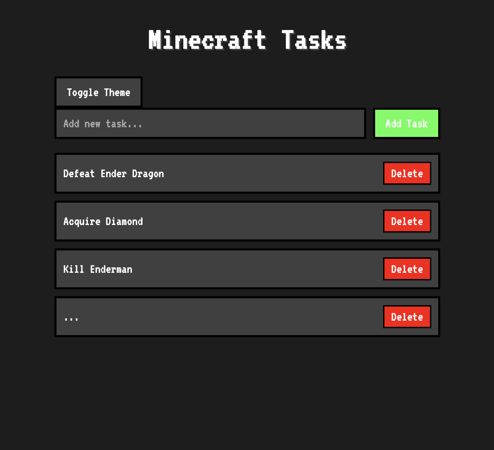

# 🎮 Minecraft-Themed Todo App

A nostalgic Minecraft-inspired todo list application that brings the classic blocky aesthetic to your daily task management.

## 🎯 About

This project combines the simplicity of a todo list with the beloved Minecraft aesthetic. Created out of nostalgia and love for Minecraft, this app aims to make task management more enjoyable by incorporating elements from one of gaming's most iconic titles.

### Features
- ⚔️ Minecraft-styled UI elements
- 🌓 Dark/Light mode toggle
- 💾 Local storage persistence
- 📱 Responsive design
- 🎨 Pixelated font and buttons
- 🏗️ Classic Minecraft dirt texture background

## 🚀 Live Demo
[View Live Demo](https://nigelnh.github.io/minecraft-theme-todo/)

## 💻 Technologies Used
- HTML5
- CSS3
- JavaScript
- Google Fonts (VT323)
- Local Storage API

## 🎮 How to Use
1. Clone the repository:
2. Open `index.html` in your browser
3. Start adding your tasks!

## 🛠️ Features
- Add new tasks
- Mark tasks as complete
- Delete tasks
- Tasks persist between sessions
- Toggle between dark and light modes
- Minecraft-styled UI elements

## 🎨 Customization
You can customize the app by modifying the CSS variables in the `:root` selector:

## 💭 Personal Note
I created this project because I wanted something that would make task management more engaging while paying homage to a game that defined my childhood. Minecraft has always been about building and creating, and this todo app brings that same spirit to organizing daily tasks. The familiar textures and pixelated aesthetics serve as a nostalgic reminder of the countless hours spent mining and crafting, now repurposed to help stay focused and productive.

## 🤝 Contributing
Contributions, issues, and feature requests are welcome! Feel free to check the [issues page](https://github.com/nigelnh/minecraft-theme-todo/issues).

## 🙏 Acknowledgments
- Minecraft for the inspiration
- [VT323 Font](https://fonts.google.com/specimen/VT323) by Peter Hull
- Minecraft textures and aesthetics by Mojang

---
Made with ❤️ and a bit of nostalgia 🎮
